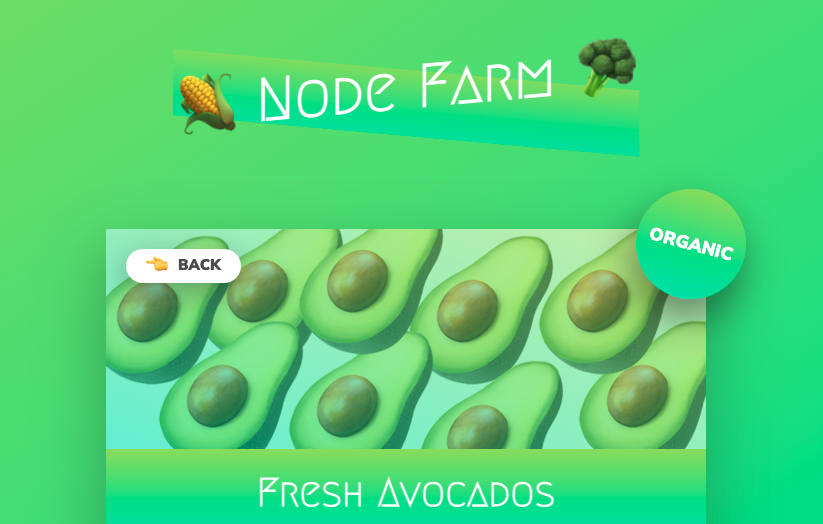

# Farm Produce - in Node!

> A refresher project to review the basic node.js fundamentals, including:

- Reviewing core modules
- Creating web server
- Routing
- Simple API
- HTML Templating
- Parsing Variables
- Modules



## Live Demo

Available at the following hosting platforms:

1. Node.js hosted at [Vercel](https://node-farm-five.vercel.app/)

## Development

1. Clone the repo.

   ```sh
   git clone git@github.com:ruaraikirk/node-farm.git
   ```

2. Install the packages by running `npm install`.

3. Start the application locally.

   ```sh
   npm run start
   ```

4. Verify by opening the following URL in broswer.
   ```sh
   http://127.0.0.1:8000/
   ```

## Deployment

1. To deploy serverless function in Vercel, a vercel.json file was added in root directory of the project.

   ```json
   {
     "version": 2,
     "name": "node-farm",
     "builds": [
       {
         "src": "index.js",
         "use": "@vercel/node"
       }
     ],
     "routes": [
       {
         "src": "/(.*)",
         "dest": "/index.js"
       }
     ]
   }
   ```

2. Create a project in Vercel. Configure the project by importing the GitHub project.

3. Deploy the project.
